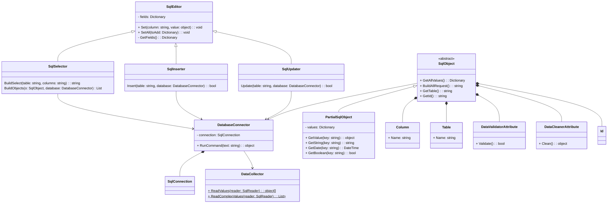

# Truffle Library
Truffle is a lightweight SQL management library written on top of `ASP.net` that aims to simplify interactions between a backend API and its SQL Databases. Programs written with this library are similar to Java Spring in that they follow a Modelling framework with the use of Attributes to represent tables, columns and fields.

## Table of Contents
* [Introduction](#introduction)
* [Technologies](#technologies)
* [Structure Overview](#structure-overview)
* [Usage](#usage)
    - Connecting to a database
        - [Sql Databases and Queries](#sql-databases-and-queries)
        - [Running Commands](#running-commands)
        - [Running Procedures](#running-procedures)
    - Using models
        - [Creating a Model](#creating-a-model)
        - [Instantiating by Key](#instantiating-by-key)
        - [Instantiating by Column](#instantiating-by-column)
        - [Instantiating with Values](#instantiating-with-values)
        - [Instantiating without Values](#instantiating-without-values)
        - [Modifying a Database](#modifying-a-database)
        - [PartialSqlObject](#using-partialsqlobject)
    - Retrieving and modifying data
        - [Selecting](#selecting-from-a-table)
        - [Updating](#updating-a-table)
        - [Updating with custom parameters](#updating-with-sqlselector)
        - [Inserting](#inserting-to-a-table)
    - Data Validation
        - [Data Validation in Truffle](#data-validation-in-truffle)
        - [Adding Validation](#adding-validation)
        - [Enabling and Disabling Validation](#enabling-and-disabling-validation)
        - [Custom Validations](#writing-custom-validations)
    - Asynchronous methods
        - [Asynchronous Support](#asynchronous-methods-in-truffle)
* [Additional Notes](#additional-notes)

## Introduction
Truffle's classes provide 3 main utilities:
1. Running queries and procedures in an SQL database with automatic result parsing
2. Modeling and mapping of table columns to POCOs
3. Updating and inserting values into a table with direct mapping from created models

These functions may be utilised by instantiation and/or extension of Truffle's classes that allow for the flexible retrieval and modification of data.

## Technologies
* Dotnet version: 6.0

#### Dependencies
* System.Data.SqlClient Nuget Package provided by ASP.net

## Structure Overview
### Class Structure
The basic structure of Truffle is shown below:

* `DatabaseConnector` is a wrapper class that holds an `SqlConnection`. It provides a method to run SQL queries and collect result values with the use of `DataCollector`
* `DataCollector` is a static class that provides methods to collect values from an SQL query into  `object[]` and `Dictionary` formats
* `SqlObject` is an abstract class that represents a model of an entry in a sql table, and classes that extend it may be instantiated with a `DatabaseConnector`. `SqlObject` maps values to properties with the use of attributes `Column`, `Table` and `Id` as flags
* `DataValidatorAttribute` and `DataCleanerAttribute` are attributes that can be additionally used by `SqlObject` to provide data conversions and validations
* `PartialSqlObject` is an extension of `SqlObject` that retrieves column values even if their corresponding properties are not present in the model. This is useful for large tables with many columns that may need to be returned but not read
* `SqlEditor` is an abstract class that provides methods to collect parameters into a `Dictionary` to perform subsequent SQL queries
* `SqlInserter`, `SqlUpdater` and `SqlSelector` are all classes used for table modification that extend the `SqlEditor` class and respectively provide methods to insert update, and select data in an SQL table.


## Usage
### Table of Contents
- Connecting to a database
    - [Sql Databases and Queries](#sql-databases-and-queries)
    - [Running Commands](#running-commands)
    - [Running Procedures](#running-procedures)
- Using models
    - [Creating a Model](#creating-a-model)
    - [Instantiating by Key](#instantiating-by-key)
    - [Instantiating by Column](#instantiating-by-column)
    - [Instantiating with Values](#instantiating-with-values)
    - [Instantiating without Values](#instantiating-without-values)
    - [Modifying a Database](#modifying-a-database)
    - [PartialSqlObject](#using-partialsqlobject)
- Retrieving and modifying data
    - [Selecting](#selecting-from-a-table)
    - [Updating](#updating-a-table)
    - [Updating with custom parameters](#updating-with-sqlselector)
    - [Inserting](#inserting-to-a-table)
- Data Validation
    - [Data Validation in Truffle](#data-validation-in-truffle)
    - [Adding Validation](#adding-validation)
    - [Enabling and Disabling Validation](#enabling-and-disabling-validation)
    - [Custom Validations](#writing-custom-validations)
- Asynchronous methods
    - [Asynchronous Support](#asynchronous-methods-in-truffle)

## Sql Databases and Queries
The connection to an SQL database is created when a `DatabaseConnector` object is instantiated with a connection string:

```C#
public void ConnectToDatabaseExample()
{
    // Get a connection string
    string str = "YourConnectionString";
    using (DatabaseConnector database = new DatabaseConnector(str))
    {
        // Use the DatabaseConnector here to run sql queries or to create SqlObjects
    }
}
```  

> NOTE: `DatabaseConnector` is disposable and should hence be used in a disposable context (either with the `using` keyword or by calling `Dispose()` when it is no longer needed).

Once it is instantiated, it may then be used to run regular SQL queries or procedures, or create instances of SqlObjects.  


## Running Commands
Sql queries may be run with the `DatabaseConnector` by calling its `RunCommand()` method:

```C#
using (DatabaseConnector database = new DatabaseConnector(str))
{
    var response = (object[]) database.RunCommand("select * from [dbo].[yourtable]");
}
```

By default, `RunCommand()` returns an `object[]` of all the values from the query, but it may be configured by adding an additional `complex` argument and setting it to `true` for it to return a more complex output:

```C#
var response = (List<Dictionary<string, object>>) database.RunCommand("mycommand", complex: true);
```

This is useful when handling a query that would return multiple rows of data, or if you wish to have your values mapped to their respective column names.


## Running Procedures
Procedure calls are similarly made with the `RunCommand()` method, but with the configuration of additional parameters to execute the call:

```C#
using (DatabaseConnector database = new DatabaseConnector(str))
{
    var procedureName = "MyProcedure";
    string[] parameters = ["param1", "param2"]; // Your procedure parameters
    var response = (object[]) database.RunCommand(procedureName, true, parameters);
}
```

`RunCommand` takes `true` as a second argument to indicate that the command is a procedure instead of a regular query. It then uses the `string[]` provided as a third argument as parameters to execute the procedure.

Similar to a regular query, `complex` may also be set to `true` for a more substantial output.


## Creating a Model
In order to make use of the modelling capabilities of Truffle, we must first create a POCO (Plain old C# Object) that represents an entry in our table with some additional annotations:

```C#
[Table("[dbo].[tblDog]")]
public class Dog : SqlObject
{
    [Id, Column("Name")]
    public string MyName {get;set;}
    [Column("Age")]
    public int Age {get;set;}
    [Column("Owner")]
    public string Owner {get;set;}
    [Column("dob")]
    public DateTime DateOfBirth {get;set;}
}
```
There are several cases in which you may not know which columns will be returned (For example, in the case of a REST API that might need to return columns but does not need to read them, or if a table has dynamic columns that need to be read). In such cases, the use of a [PartialSqlObject](#using-partialsqlobject) might be more suitable.

There are some important things to note:
1. `Dog` extends the SqlObject class which provides it with its required additional methods and mappings.
2. `Table` is used to indicate the table which stores the data of `Dog`.
3. `Column` is used to indicate the column which the property corresponds to.
4. `Id` is used to indicate that the column is a `Key` (unique). There should only be one `Id` for every object.

These annotations are based on Java Spring's Database API, so developers who have used the framework will find these familiar.

We can then make use of several of `SqlObject`'s built-in constructors to instantiate our model in different ways:


### Instantiating by Key
`SqlObject` can be instantiated by accepting a value for its `Id` column:

```C#
[Table("[dbo].[tblDog]")]
public class Dog : SqlObject
{
    [Id, Column("Name")]
    public string Name {get;set;}
    // ...
    public Dog(object value, DatabaseConnector db): base(value, db) {}
}

public static class Main
{
    public static void Run()
    {
        using (DatabaseConnector database = new DatabaseConnector("MyConnectionString"))
        {
            // Get a dog with Name='Spot'
            Dog dog = new Dog("Spot", database); 

            // Prints "Hi, my name is Spot!"
            Console.WriteLine($"Hi, my name is {dog.Name}!");
        }
    }
}
```

Note that the base constructor needs to be called in the inherited class for this to work. This is true for **all** constructors provided by `SqlObject`


### Instantiating by Column
An `SqlObject` can also be instantiated by identifying an entry by column. In the case that there are multiple results for the identifier, only the first one is mapped and returned.

```C#
[Table("[dbo].[tblDog]")]
public class Dog : SqlObject
{
    [Column("Owner")]
    public string Owner {get;set;}
    // ...
    public Dog(object value, string key, DatabaseConnector db): base(value, key, db) {}
}

public static class Main
{
    public static void Run()
    {
        using (DatabaseConnector database = new DatabaseConnector("MyConnectionString"))
        {
            // Get a dog with Owner = Tom'
            Dog dog = new Dog("Tom", "Owner", database); 

            // Prints "Hi, my name is Owner!"
            Console.WriteLine($"Hi, my owner is {dog.Owner}!");
        }
    }
}
```  


### Instantiating with Values
In the case that a model should be instantiated with values instead of directly from a database, this may be done by passing a `Dictionary` into its constructor:

```C#
using (DatabaseConnector database = new DatabaseConnector("MyConnectionString"))
{
    //Get all entries from a table
    string command = $"select * from {new Dog().GetTable()}";
    var response = (List<Dictionary<string, object>>) database.RunCommand(command, complex:true);
    
    Console.WriteLine("This is a list of dogs.");
    foreach (var item in response)
    {
        // Instantiate Dog with a dictionary
        Dog dog = new Dog(item);
        
        Console.WriteLine(dog.Name);
    }
}
```
> NOTE: The code above creates a List of `Dog` objects, which may also be achieved with the [`SqlSelector`](#selecting-from-a-table) class.


### Instantiating without Values
An `SqlObject` may also be instantiated without any arguments:
```C#
Dog dog = new Dog();
```
This may be useful when creating new entries for a table that do not have values at the time of creation.


## Reading a Model
An `SqlObject` has several built-in methods that are useful in interacting with it.

* `LogValues()` Is a method for debugging that logs all properties in an SqlObject
* `GetAllValues()` Is a method that returns a `Dictionary` of all the properties of the model corresponding to a column.
* `GetId()` and `GetTable()` returns the value of the `Table` and `Id` annotations of the model, which may be used for encapsulation of the model.
* `BuildAllRequest()` returns an Sql query which selects all rows in a table and returns all values with a corresponding property in the model.

## Modifying a Database
`SqlObject` has built in functions that allow it to create an instance of itself in an Sql database, or update an existing entry corresponding to its key column.

```C#
using (DatabaseConnector database = new DatabaseConnector("MyConnectionString"))
{
    // Create a new Dog
    var dog = new Dog();
    dog.Owner = "Scott";
    dog.Name = "Spot";

    // Add the dog to a database
    dog.Create(database);

    // Change a value
    dog.Owner = "Matthew";

    // Update the exisitng entry in a database
    dog.Update(database);
}
```


## Using PartialSqlObject
There are some cases in which column values need to be stored, but they are not used actively in a model (Eg. an API service which might need to select all columns for an entry, but does not reference them internally).

In such cases, `PartialSqlObject` may be used instead of `SqlObject` to reduce the amount of boilerplate code that is required.

`PartialSqlObject` is an extension of `SqlObject` that selects ALL(*) columns in a table when creating an object, and stores them regardless of whether they correspond to a property in the model. This means that `GetAllValues()` returns the full result of the table without needing to define unused properties.

```C#
[Table("[dbo].[tblDog]")]
public class Dog : PartialSqlObject
{
    [Id, Column("Name")]
    public string Name {get;set;}
    public Dog(object value, DatabaseConnector db): base(value, db) {}
}

public static class Main
{
    public static void Run()
    {
        using (DatabaseConnector database = new DatabaseConnector("MyConnectionString"))
        {
            // Get a dog with Name = Spot'
            Dog dog = new Dog("Spot", database); 

            // Modify its properties
            dog.Name = "Spotto";

            // Get all its values and print them
            // The output will have ALL the columns from [tblDog]
            // Its new Name property will also be reflected
            Dictionary<string, object> values = dog.GetAllValues();
            foreach (string key in values.Keys)
            {
                Console.WriteLine($"{key}: {values[key]}");
            }
        }
    }
}
```

## Selecting from a Table
Truffle provides an `SqlSelector` class which provides methods to build a select command with specific parameters and columns. This class [may be used in conjunction with `SqlUpdater`](#updating-with-sqlselector) to update columns with specific parameters.

Usage:

```C#
// Create an SQL selector
SqlSelector selector = new SqlSelector();

// Select rows where breed = "Golden Retriever"
selector.Set("breed", "Golden Retriever");

// Select rows where age is between 3 and 5. 
// A SetBetween() method is also provided that has the same function
int[] ages = {3,5};
selector.Set("age", ages);

// Get the string from the selector that returns columns name and owner
string cmd = selector.BuildSelect("[dbo].[tblDog]", "name, owner");
var result = database.RunCommand(cmd);
}
```

On top of the `BuildSelect()` method, SqlSelector is also able to directly parse select results into SqlObjects with its asynchronous `BuildObjects` method:

```C#
// Create an SQL selector
SqlSelector selector = new SqlSelector();

// Select rows where breed = "Golden Retriever"
selector.Set("breed", "Golden Retriever");

// Select rows where age is between 3 and 5
int[] ages = {3,5};
selector.Set("age", ages);

// Parse all the results into a list of SqlObjects
// This method requires the instantiated class to have a constructor that takes no arguments.
List<Dog> result = await selector.BuildObjects<Dog>(database);
```

## Updating a table
Truffle provides an `SqlUpdater` class which provides flexible formats to update a table:

```C#
// Create an SQL updater and sets its target to rows where Name='Spot'
SqlUpdater updater = new SqlUpdater("Spot", "Name");

// Add values for the updater to set
updater.Set("Age", 3);
updater.Set("Owner", "Mike");

// Update the corresponding table in the database with new values
updater.Update("[dbo].[tblDog]", database);
}
```

`SqlUpdater` also directly accepts an `SqlObject` and will update all of its values accordingly:

```C#
// Instantiates a Dog from the database
Dog dog = new Dog("Spot", database);

// Change values
dog.Owner = "Mike";

// Create an SQL updater and sets its target to rows where Name='Spot'
SqlUpdater updater = new SqlUpdater(dog);

// Update the corresponding table in the database with new values
updater.Update(dog.GetTable(), database);
}
```

## Updating With SqlSelector
In the case that items with specific parameters need to be updated, it is also possible to directly pass an `SqlSelector` into `SqlUpdater`:

```C#
// Instantiate an SqlSelector and set its selection to ages between 1 and 2
SqlSelector selector = new SqlSelector();
selector.SetBetween(1, 2, "age");

// Create an SQL updater with the SqlSelector
SqlUpdater updater = new SqlUpdater(selector);
updater.Set("Owner", "Local Pet Store");

// Updates all corresponding rows in the database with new values
updater.Update(dog.GetTable(), database);
```


## Inserting to a Table
Truffle provides an `SqlInserter` class which provides flexible formats to update a table, in similar fashion to `SqlUpdater`:
```C#
// Create an SQL inserter
SqlInserter inserter = new SqlInserter();

// Add values for the inserter to set
inserter.Set("Name", "Ruff");
inserter.Set("Age", 3);
inserter.Set("Owner", "Mike");

// Update the corresponding table in the database with new values
inserter.Insert("[dbo].[tblDog]", database);
}
```

`SqlInserter` may also be instantiated with an `SqlObject` with similar behaviour to `SqlUpdater`.  


## Data Validation in Truffle
Truffle allows data to be validated and/or cleaned before it is entered or updated in a database through the use of data validation attributes.

There are two forms of validation in Truffle:
1. Data Cleaning, which converts values to other formats such as rounding numbers or simplifying strings, as defined by the `DataCleanerAttribute` class.
2. Data Validation, which returns whether values are valid, as defined by the `DataValidationAttribute` class

While these validations are automatically called before an `SqlObject` is inserted or updated in a database, they may also be called manually with methods `Clean()` and `Validate()`. 

## Adding Validation

To use data validation, append their corresponding attributes to properties in your SqlObject model:

```C#
[Table("[dbo].[tblDog]")]
public class Dog : SqlObject
{
    // Only allows uppercase and lowercase letters, . / and -
    // Cannot be null or an empty string
    [Id, Column("Name"), SimpleString, Required]
    public string MyName {get;set;}

    // Rounds values to 2 decimal places
    [Column("Age"), Decimals(2)]
    public double Age {get;set;}

    // Converts value to a SimpleString, and turns any invalid characters to '-'
    [Column("Owner"), SimplifyString]
    public string Owner {get;set;}

    [Column("dob")]
    public DateTime DateOfBirth {get;set;}
}
```
These validations are then taken into account when entering or modifying data in the database.


Existing data cleaners:
- `DecimalsAttribute` - rounds a value to a set number of decimal places
- `SimplifyString` - converts any invalid characters (not an uppercase or lowercase letter and not . / or -) into dashes

Exiting data validators:
- `SimpleString` - checks if a string is a simple string (not an uppercase or lowercase letter and not . / or -)
- `Required` - checks if a field is filled (not null or an empty string)


## Enabling and Disabling Validation
Validation for an SqlObject is on by default and can be turned off manually. If validation should be ignored for an action, this can be indicated by setting `validate` to false in relevant methods:

```C#
// All of these methods will ignore validation
dog.Update(database, validate:false);
dog.Create(database, validate:false);

var selector = new SqlSelector(dog, validate:false);
var updater = new SqlUpdater(dog, validate:false);
```

## Writing Custom Validations
To write a custom validation, the `DataValidatorAttribute` or `DataCleanerAttribute` class can be extended:

```C#
// This validator only checks if a dog has an owner if its age is greater than 2
public class IfAge: DataValidatorAttribute
{
    public override bool Validate(object value, SqlObject model)
    {
        var dog = (Dog model)
        if (dog.Age < 2 || value != null) return true;
        this.SetMessage("This dog is older and requires this field");
        return false;
    }
}

// This cleaner treats a string as a double and rounds it
public class StringDecimalsAttribute: DataCleanerAttribute
{
    private readonly int places;
    public StringDecimalsAttribute(int places)
    {
        this.places = places;
    }
    public override object Clean(object value, SqlObject model)
    {
        if (value == null) return null;
        var str = value.ToString();
        
        // Convert the string to a double and round it with the Decimals attribute
        var val = double.Parse(str);
        var result = new DecimalsAttribute(places).Clean(val, model);

        // Convert the double back to a string and return it
        return result.ToString();
    }
}
```

`Clean()` and `Validate()` are both abstract methods that need to be implemented, and provide the main purpose of these classes to clean and validate data passed into them. Their methods additionally accept an `SqlObject` that allows them to reference other values in the object.

These attributes can then be used normally in your models:

```C#
[Table("[dbo].[tblDog]")]
public class Dog : SqlObject
{
    // Will require a name if Age > 2
    [Id, Column("Name"), IfAge]
    public string MyName {get;set;}

    [Column("Age"), Decimals(2)]
    public double Age {get;set;}

    // Rounds weight to 2 decimal places but stores it as a string
    [Column("Weight"), StringDecimals(2)]
    public string Weight {get;set;}

    [Column("Owner"), IfAge]
    public string Owner {get;set;}
}
```


## Asynchronous Methods in Truffle
In addition to methods mentioned in this README, Truffle also provides asynchronous versions of most of its methods. Users can refer to the XML documentation in each class for more information on these methods.

> NOTE: Running asynchronous methods in an SQL database may require you to enable `MultipleActiveResultSets` in your SQL connection string.


## Additional Notes
* While case sensitivity for inserts and selects are not an issue for Truffle, it must be strictly adhered to when using `PartialSqlObject` as it may cause unpredictable behaviour.
* Truffle is still under heavy development and all of its classes are still subject to change.
* Planned additions include allowing the `SqlSelector` class to select optional parameters with `OR`, as well as an `SqlObjectBuilder` that would allow for even more flexible creation of SqlObjects.

[Back to Top](#truffle-library)
